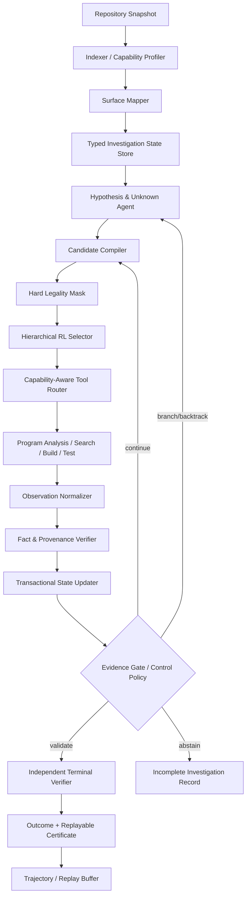
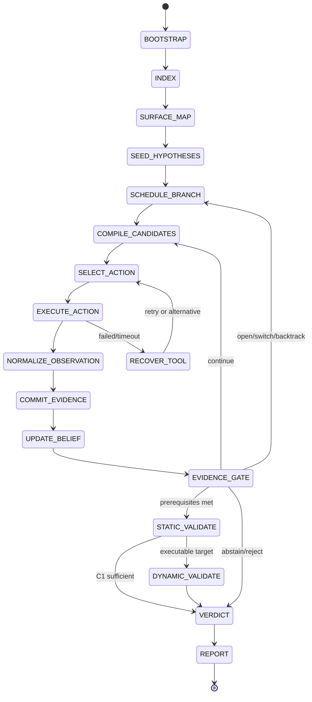

# Evidence-Guided Security Investigation 完整系统设计

**版本**：1.0  
**日期**：2026-08-24  
**输入文档**：`evidence_guided_security_investigation_agent_design.md`  
**目标**：把“证据驱动的安全调查”从概念性状态—动作建模，推进为可实现、可训练、可复现、可评测的代码审计系统。

---

## 0. 设计决策摘要

系统采用一个**近似 Belief-State Semi-MDP**：状态不是当前代码位置，而是当前焦点、带来源的观测与事实、漏洞假设、证据图、关键未知项、分支历史、工具能力和剩余预算。系统的中心控制对象不是任意 shell 命令，而是 30 个有类型的 Security Investigation Primitive。

完整方案由两项核心方法和三项支撑机制组成：

1. **Executable Typed Audit Automaton**：定义可机器检查的状态、转换、不变量、分支、回溯、停止、拒绝和证实语义。
2. **Proof-Obligation-Conditioned Hierarchical Selector**：学习在当前证明状态下，下一步应调查哪个假设、哪个证明义务、执行哪个 primitive、绑定哪个实体、选择哪个工具与控制动作。
3. **Verifier-Grounded Credit**：只有经工具 receipt 或独立验证器接受的证明增量才产生在线密集奖励；置信度自增不产生奖励。
4. **Replayable Evidence Infrastructure**：每条证据都可追溯、可版本化、可重放；终态输出 proof certificate。
5. **Investigation Curriculum**：从单文件、单 Unknown 逐步扩展到跨过程、多分支、工具失效和未见仓库。

Evidence Graph、Hypothesis Validation、多 Agent 分工和普通 verifier 在 2026 年已出现明确近邻；因此它们在本设计中是基础设施，而不是单独的新颖性主张。核心研究问题限定为：

> 在机器可检查的审计状态契约和预算约束下，如何学习一个证明义务驱动、动作合法性受约束、能够停止/分支/回溯并跨仓库迁移的 next-investigation policy？

---

## 1. 目标、边界与成功合同

### 1.1 系统目标

- 在大型仓库中定位、证实或有证据地否定漏洞假设；
- 在固定 Token、工具调用、分析时长和分支数预算下最大化独立验证成功率；
- 让每个状态变化、每个奖励和每个终态结论都能追溯到具体工具、代码版本与查询；
- 将“下一步调查什么”与“用哪个工具执行”解耦；
- 对工具缺失、构建失败、语言变化和分析不完备提供显式降级路径；
- 产出可用于 BC、Offline RL、Process Reward、Online RL 和策略评测的标准轨迹。

### 1.2 非目标

- 不把系统退化为 `P(vulnerability | code)` 分类器；
- 不把 CFG/CG/DDG 的边直接当作策略动作；
- 不允许 LLM 自由生成任意 shell 作为学习动作；
- 不把“工具未返回结果”解释为“程序中不存在该事实”；
- 不用 LLM 自报置信度替代证据；
- 不要求每个逻辑 Agent 对应一个独立模型进程，角色可共享模型与服务。

### 1.3 端到端成功合同

一个审计 episode 必须输出以下三类 outcome 之一：

```text
CONFIRMED  — 预先声明的 proof certificate 等级已满足并通过独立复核
REJECTED   — 假设存在可靠反证、互斥事实或有界负搜索证书
ABSTAIN    — 证据不足、低预期价值、预算耗尽、工具不可用或超时
```

`outcome` 与 `stop_reason` 分离：

```text
PROOF_COMPLETE
PROOF_CONTRADICTION
BOUNDED_NEGATIVE_SEARCH
LOW_EXPECTED_VALUE
BUDGET_EXHAUSTED
TOOL_UNAVAILABLE
TIMEOUT
POLICY_UNCERTAIN
```

搜索不到调用链、guard 或 sink 只是一个带 `scope/tool/version` 的负观测；它本身既不是全局事实，也不支持 `REJECTED`。

---

## 2. 研究定位与新颖性边界

| 近邻 | 已覆盖能力 | 本设计必须额外证明的差异 |
|---|---|---|
| [RepoAudit](https://arxiv.org/abs/2501.18160) | 按需仓库探索、data-flow memory、validator、路径条件检查 | 可执行 typed transition、pre-execution legality、learned stop/backtrack 和证明义务策略 |
| [JitVul](https://arxiv.org/abs/2503.03586) | 漏洞引入/修复对、仓库级检测评测 | 预算化多步调查决策和细粒度轨迹评测 |
| [SEC-bench](https://arxiv.org/abs/2506.11791) | 真实 PoC/patch 自动评测与可重现 harness | 调查阶段的动作价值、证据构造和信用分配 |
| [VulAgent](https://arxiv.org/abs/2509.11523) | hypothesis-validation、多视角 Agent | 机器可检查自动机和学习式 next-investigation policy |
| [VulnAgent-R2](https://arxiv.org/abs/2603.13384) | evidence calibration、counterfactual reweighting、build-aware verifier、cost-risk scheduler | 同候选集下的层级 RL、动作合法性、控制 option 和跨仓库状态抽象 |
| [Hound](https://github.com/scabench-org/hound) | graph、belief/hypothesis、strategic planning | typed effect、终态证明语义、可验证过程奖励和可学习控制 |
| [VulnGym](https://arxiv.org/abs/2608.02001) | 408 个仓库级漏洞条目及 entry/critical operation/trace 标注 | 用作 localization、evidence construction、policy decision 的多级评测 |
| [Agent-as-Tool](https://arxiv.org/abs/2507.01489)、[GLIDER](https://openreview.net/forum?id=pdNtji3ktF) | 通用层级决策与工具调用 | 高层 option 显式对应漏洞证明义务，低层实体指针绑定安全调查对象 |
| [Similar](https://openreview.net/forum?id=OKWlVPHeW1)、[ReVeal](https://www.microsoft.com/en-us/research/publication/reveal-self-evolving-code-agents-via-reliable-self-verification/)、[VerlTool](https://openreview.net/forum?id=g2LCOW43Md) | step-wise reward、turn-level credit、异步 agentic RL | 由独立程序验证接受的 proof delta，而非自然语言步骤质量 |

必须降级为背景或基础设施的表述：首次使用 Evidence/Hypothesis Graph、首次 hypothesis validation、首次多 Agent、首次 verifier、首次 hierarchical tool routing。可检验的核心主张只有：

1. typed automaton 降低非法/冗余调查且不牺牲真实发现率；
2. proof-obligation-conditioned selector 在相同工具、候选动作和预算下优于 flat policy、ReAct、启发式与 cost-risk scheduler；
3. 只有在 pilot 成立时，verifier-grounded counterfactual credit 才升级为第三项方法贡献。

---

## 3. 形式化问题

### 3.1 近似 Belief-State Semi-MDP

定义：

\[
\mathcal{M}=(\mathcal{S},\mathcal{A},\mathcal{O},T,R,\gamma,\mathcal{B},\Omega)
\]

- \(\mathcal{S}\)：带历史摘要的结构化调查 belief state；
- \(\mathcal{A}\)：有类型、可参数化、具有持续时间的调查 primitive；
- \(\mathcal{O}\)：工具产生的带能力边界和 provenance 的观测；
- \(T\)：事务式状态更新；
- \(R\)：终态效用、验证式 proof delta 与成本的组合；
- \(\mathcal{B}\)：Token、工具、时间、分支和静态分析预算；
- \(\Omega\)：漏洞类别对应的 proof-obligation 模板。

动作持续时间不同，因此使用 Semi-MDP 回报：

\[
Q(S_t,a_t)=\mathbb{E}\left[R_t+\gamma^{\Delta t}V(S_{t+1})\right]
\]

压缩状态可能遗漏原始代码细节和观察顺序，所以本设计只声称 approximate belief-state；不在未验证 Markov 性前宣称 potential shaping 保持理论最优策略不变。

### 3.2 状态定义

\[
S_t=(C_t,O_t,F_t,D_t,H_t,E_t,U_t,P_t,K_t,B_t,X_t)
\]

| 字段 | 含义 | 更新者 |
|---|---|---|
| `C` Current Focus | 当前 component/function/symbol/branch/hypothesis | Orchestrator |
| `O` Observations | 工具原始输出摘要及 scope、版本、失败信息 | Tool Executor |
| `F` Facts | 通过 schema 与 receipt 验证的程序事实 | Evidence Curator |
| `D` Derived Claims | 由多条事实推导但未独立确认的语义命题 | Semantic Agent |
| `H` Hypotheses | 漏洞假设、先验、义务、分支与反证 | Hypothesis Agent |
| `E` Evidence Graph | 带版本、来源、置信与矛盾边的图 | Evidence Curator |
| `U` Unknowns | 可回答的关键安全问题及 resolution rule | Hypothesis Agent |
| `P` Proof State | 各 proof obligation 的状态和证书等级 | Verifier |
| `K` Capability Matrix | 工具可用性、语言支持、成本、可靠性 | Orchestrator |
| `B` Budget | Token/调用/时长/分支/查询预算 | Orchestrator |
| `X` Bounded History | 最近动作签名、失败、负搜索 scope、checkpoint | State Store |

### 3.3 Observation、Fact、Claim、Hypothesis 的边界

```text
Observation: “CodeQL q@v1 在 scope R 中未返回路径”
Fact:        “在工具 q@v1、scope R、timeout T 下没有找到满足查询语义的路径”
Claim:       “当前可见路径可能不可达”
Hypothesis:  “入口无法到达 sink，因此 H1 可能不成立”
```

LLM 只可写入 `Derived Claim` 或 `Hypothesis`。任何 `Fact` 都必须引用可重放 receipt；工具结果也不是普遍语义真值，只是具有能力边界的观测。

### 3.4 Evidence Edge

```yaml
edge_id: E-184
subject: request.user_id
predicate: DATA_FLOW
object: GetResource.arg0
truth_status: confirmed        # confirmed | refuted | bounded_negative | unknown
confidence: 0.97
scope: repo@commit:function-set
provenance:
  tool: codeql
  tool_version: 2.x
  query_hash: sha256:...
  source_hash: sha256:...
  location: service.cpp:123-131
  receipt_uri: receipts/E-184.json
validity:
  build_profile: debug-x64
  created_at: 2026-08-24T12:00:00+08:00
contradicts: []
```

### 3.5 Hypothesis Card

```yaml
hypothesis_id: H-001
type: authorization_bypass
statement: externally supplied subject may select another principal's resource
security_roles: [ENTRY, ATTACKER_VALUE, IDENTITY, RESOURCE, GUARD, SINK]
prior: 0.35
posterior: 0.62
proof_template: AUTHZ-1
proof_obligations:
  - {id: O1, kind: relevant_entry, status: verified, evidence: [E-10]}
  - {id: O2, kind: attacker_influence, status: verified, evidence: [E-31]}
  - {id: O3, kind: reachability, status: partial, evidence: [E-47]}
  - {id: O4, kind: violated_auth_relation, status: unresolved, unknown: U-7}
  - {id: O5, kind: missing_or_bypassable_guard, status: unresolved, unknown: U-8}
  - {id: O6, kind: impact, status: unresolved, unknown: U-9}
supporting: [E-10, E-31, E-47]
counter_evidence: []
falsifier: calling identity dominates sink and is bound to resource owner
parent: null
branch_id: H-001/B0
outcome: investigating
```

### 3.6 Unknown

每个 Unknown 必须可操作，不能只是开放式问题：

```yaml
unknown_id: U-8
question: does an authorization guard dominate the resource access?
kind: guard_presence
criticality: 1.0
answer_domain: [present_valid, present_bypassable, absent_in_scope, unresolved]
resolution_rule:
  positive: verified_guard_edge
  negative: bounded_dominator_search_certificate
candidate_targets: [HandleRequest, Process, GetResource]
status: unresolved
```

### 3.7 证书等级

| 等级 | 定义 |
|---|---|
| `C1_STATIC` | provenance-complete 静态证明，关键路径/约束可重放 |
| `C2_EXECUTABLE` | build/test 可复现安全不变量被违反 |
| `C3_IMPACT` | 端到端 reproducer 或 PoC 展示影响 |
| `C4_PATCH_DIFFERENTIAL` | 修复版本消除行为，且同一证书在 paired hard negative 上通过 |

每类漏洞在 episode 开始时声明最低确认等级。例如授权漏洞默认至少 `C2`，仅在无法构建但 C1 完整且双工具一致时允许 `C1`，并在报告中明确等级。

---

## 4. 总体架构



控制平面只接受 DSL 动作；工具适配器可以内部使用 CodeQL、Semgrep、clangd/LSP、CPG、AST、grep、build、test 或自定义查询，但原始命令不进入学习动作空间。

---

## 5. 可执行审计自动机

### 5.1 状态图



### 5.2 全流程

1. **BOOTSTRAP**：冻结 repository/commit/build profile，记录 hash、威胁模型、scope 与预算。
2. **INDEX**：生成 AST、CFG、CG、DDG/CPG、type hierarchy、build/test/git 索引；测量工具能力。
3. **SURFACE_MAP**：识别 entry、trust boundary、identity、resource、guard、sink 和生命周期对象。
4. **SEED_HYPOTHESES**：结合静态 seed、secure contrast 和语义分析生成 Hypothesis Card；每张卡必须带 falsifier 与 proof template。
5. **SCHEDULE_BRANCH**：在多假设间分配预算，选择 active branch。
6. **COMPILE_CANDIDATES**：从缺失 proof obligation、图 frontier、经验检索和 LLM proposal 生成至多 64 个绑定候选。
7. **SELECT_ACTION**：先执行 hard mask，再由层级 policy 选择 hypothesis/obligation/primitive/entity/tool/control。
8. **EXECUTE_ACTION**：工具适配器执行 primitive，返回结构化 observation、receipt、coverage 与 cost。
9. **NORMALIZE_OBSERVATION**：清洗、去重、定位、标注工具 scope；空结果保持为 bounded observation。
10. **COMMIT_EVIDENCE**：验证 schema/provenance，事务式提交 Fact、Derived Claim、Evidence Edge 和 Unknown resolution。
11. **UPDATE_BELIEF**：校准 Hypothesis posterior；置信度只用于排序，不产生在线奖励。
12. **EVIDENCE_GATE**：判断继续、分支、回溯、静态验证、动态验证、拒绝或 abstain。
13. **STATIC_VALIDATE**：独立重建关键路径、别名、dominance、约束可满足性和证据引用。
14. **DYNAMIC_VALIDATE**：构建 harness、执行 test/reproducer；对 patched/sibling negative 运行相同证书。
15. **VERDICT**：输出 `outcome + stop_reason + certificate_level`。
16. **REPORT**：生成证明链、复现步骤、失败范围、成本和完整审计轨迹。
17. **LEARN**：将 `(state, action, observation, evidence_delta, reward, next_state)` 写入 replay。

### 5.3 全局不变量

1. `Fact` 必须有 receipt；LLM 输出不能直接成为 Fact。
2. `Unknown.resolved` 必须引用正证据或有界负搜索证书。
3. `Hypothesis` 的每次更新必须引用本步 evidence delta。
4. Budget 对每个资源维度单调递减；退款只能由系统故障事件产生并留痕。
5. `CONFIRMED` 必须满足预声明 proof template 和最低证书等级。
6. `REJECTED` 必须有 refutation/contradiction/bounded-negative certificate。
7. `ABSTAIN` 始终合法，且不与 `REJECTED` 合并。
8. 证据版本必须与 repository snapshot 和 build profile 一致。
9. 完全相同的 action fingerprint 不能重复执行，除非输入版本、scope 或工具版本变化。
10. 终态验证器与生成证据的工具路径尽量独立。

### 5.4 Hard Legality 与 Soft Preference

Hard mask 只包含逻辑上确定的条件：

\[
M(S,a)=M_{schema}M_{target}M_{precondition}M_{branch}M_{budget\_lower\_bound}M_{exact\_duplicate}
\]

进入 soft policy feature、但不能 hard mask 的信号：预计信息增益低、工具历史成功率低、Unknown 优先级低、路径看似无关、静态查询为空。这样避免把静态分析不完备固化为搜索盲区。

### 5.5 分支、共享与回溯

- `global_shared`：repository snapshot、已确认程序事实、工具能力、全局 budget、证据版本；
- `branch_local`：active hypothesis、proof state、Unknown 排序、局部 posterior、局部 action history；
- `OPEN_BRANCH`：新假设与父假设共享 global facts，但复制 proof/unknown ledger；
- `MERGE_BRANCH`：仅当 repository/build/evidence version 一致，且无 unresolved contradiction；
- `BACKTRACK`：恢复最近 checkpoint，不删除全局确认事实，只撤销 branch-local derived claims；
- `SUSPEND` 不是终态；branch 可因低 VOI 暂停后恢复。

### 5.6 故障恢复

| 故障 | 自动处理 |
|---|---|
| tool timeout | 记录 partial receipt，缩小 scope 或换工具；最多重试 1 次 |
| build failure | 生成 build failure fact，转静态证书路径或替代 profile |
| invalid target | 标记 policy error，回到候选编译，不消耗完整工具预算 |
| conflicting tools | 建立 contradiction node，触发第三工具或源码人工语义动作 |
| state transaction failure | 回滚到 checkpoint，重放已验证 receipt |
| candidate set empty | 强制提供 `backtrack`、`open_branch`、`terminate(abstain)` |
| budget exhausted | 进入 `ABSTAIN/BUDGET_EXHAUSTED`，保留 incomplete certificate |

---

## 6. Agent 角色与全部动作设计

逻辑 Agent 是职责边界，不要求十个独立模型。确定性工具、轻量模型和主 LLM 可以复用同一执行框架。

### 6.1 Orchestrator / Automaton Agent

**输入**：AuditRequest、checkpoint、Capability Matrix。  
**动作**：`initialize_episode`、`freeze_snapshot`、`allocate_budget`、`dispatch_role`、`checkpoint`、`rollback`、`retry_tool`、`close_episode`。  
**输出**：episode manifest、state version、预算账本、事件流。  
**约束**：不得修改 Fact/Hypothesis 内容；只控制所有权、调度和事务。

### 6.2 Surface Mapper Agent

**动作**：

- `enumerate_entrypoints`：列出外部/内部入口及可达条件；
- `map_trust_boundary`：识别进程、权限域、IPC、网络、文件、插件等边界；
- `locate_sensitive_asset`：定位 identity/resource/secret/privileged operation；
- `seed_security_roles`：把实体归一化为 ENTRY、ATTACKER_VALUE、IDENTITY、GUARD、RESOURCE、SINK；
- `rank_attack_surface`：按外部性、权限差、复杂度和历史风险排序。

每个结果只作为 Observation，经过 Evidence Curator 后才成为 Fact。

### 6.3 Hypothesis & Unknown Agent

**动作**：`generate_hypothesis`、`derive_proof_obligations`、`derive_unknowns`、`refine_hypothesis`、`split_hypothesis`、`merge_hypothesis`、`propose_falsifier`、`rank_hypotheses`、`request_rejection`。

Hypothesis 必须满足：可证伪、绑定 asset/entry/sink、指定 proof template、至少一个 critical Unknown、至少一个 falsifier。`request_rejection` 只是请求，最终状态由 Verifier 决定。

### 6.4 Candidate Compiler / Planner Agent

**动作**：`select_focus_hypothesis`、`select_missing_obligation`、`retrieve_expert_pattern`、`expand_graph_frontier`、`bind_primitive_target`、`propose_secure_contrast`、`propose_control_action`、`deduplicate_candidates`。

候选集来源必须被记录：`rule_required`、`graph_frontier`、`retrieved_trace`、`llm_proposal`。策略实验必须报告 Candidate Oracle Recall。

### 6.5 Hierarchical Policy Agent

**动作**：`select_hypothesis`、`select_obligation`、`select_primitive`、`select_entity`、`select_tool`、`select_control`、`allocate_action_budget`、`emit_uncertainty`。

Policy 只从 legal candidates 中选择；它不能生成新 primitive。高不确定时使用 deterministic proof-obligation priority 作为回退，并记录 OOD 事件。

### 6.6 Program Analysis Executor Agent

**动作族**：结构、数据流、安全检查、代码历史、构建与测试。内部工具命令不暴露给 RL。每次执行输出：status、facts candidate、artifacts、coverage、cost、receipt、error class。

### 6.7 Semantic Security Agent

**动作**：`classify_operation`、`infer_security_invariant`、`explain_sink_semantics`、`identify_identity_relation`、`infer_resource_semantics`、`interpret_secure_delta`。

其输出默认是 Derived Claim；只有被静态/动态证据支持后才能升级为 Fact 或 Proof Obligation completion。

### 6.8 Evidence Curator / State Updater Agent

**动作**：`normalize_observation`、`verify_receipt`、`commit_fact`、`commit_derived_claim`、`link_evidence`、`resolve_unknown`、`deduplicate_evidence`、`open_contradiction`、`reconcile_contradiction`、`compact_graph`、`update_belief`。

Graph compaction 只能删除可重建的文本缓存，不能删除 provenance、证据边或版本信息。

### 6.9 Skeptic / Verification Agent

**动作**：`falsify_hypothesis`、`replay_receipt`、`verify_path_constraints`、`search_counter_evidence`、`compare_secure_pattern`、`run_patched_negative`、`build_reproducer`、`run_reproducer`、`check_proof_obligation`、`issue_certificate`。

生成证据和终态复核应尽量使用不同工具/查询/模型；同一工具自证只可形成较低证书等级。

### 6.10 Reporter Agent

**动作**：`assemble_proof_chain`、`compute_severity_inputs`、`render_reproduction`、`render_counter_evidence`、`render_limitations`、`emit_finding`、`emit_incomplete_record`。

Reporter 不参与 verdict；它只能呈现已签发 certificate 和未解决项。

---

## 7. Policy 可见的 30 个 Primitive

为了保持可学习性，Agent 内部动作会归并为 30 个策略 primitive：

| # | Primitive | 目标/关键参数 | 主要 effect |
|---:|---|---|---|
| 1 | `enumerate_entrypoints` | component/scope | 生成 entry observation |
| 2 | `map_trust_boundary` | component/data channel | 生成 boundary edge |
| 3 | `locate_sensitive_asset` | component/asset kind | 生成 asset/sink candidate |
| 4 | `find_callers` | function/depth | 扩展 call frontier |
| 5 | `find_callees` | function/depth | 扩展 call frontier |
| 6 | `find_references` | symbol/scope | 定位使用点 |
| 7 | `inspect_dispatch` | interface/method/class | 解析 implementation/override/type hierarchy |
| 8 | `compare_peer` | sibling/patch/variant | 生成 secure/insecure delta |
| 9 | `trace_flow` | value,direction,scope | 生成 data-flow/path edge |
| 10 | `find_source` | value/source class | 解析 attacker influence |
| 11 | `find_sink` | value/sink class | 解析 sensitive operation |
| 12 | `track_alias` | value/scope | 生成 alias edge |
| 13 | `track_field` | object.field/scope | 生成 field-flow edge |
| 14 | `verify_path_constraints` | path/condition | 生成 SAT/UNSAT/bounded result |
| 15 | `find_guard` | path/guard type | 生成 guard/control-dep edge |
| 16 | `trace_identity` | entry/path | 解析 caller/subject identity |
| 17 | `check_auth_relation` | subject/object/path | 验证 authorization invariant |
| 18 | `find_sanitizer` | value/path | 生成 sanitizer effect |
| 19 | `check_lifecycle` | resource/path | 验证 lifecycle invariant |
| 20 | `check_ownership` | resource/subject | 验证 ownership invariant |
| 21 | `check_resource_control` | entry/resource | 检查 release/rate/quota |
| 22 | `classify_operation` | region/operation | 生成 semantic claim |
| 23 | `infer_invariant` | region/asset | 生成 expected invariant |
| 24 | `update_hypothesis` | h,mode | generate/refine/split/merge |
| 25 | `falsify_hypothesis` | h/falsifier | 获取反证 |
| 26 | `validate_finding` | h/certificate level | 触发独立验证 |
| 27 | `reproduce_finding` | h/build profile | 生成/运行 test 或 PoC |
| 28 | `open_or_switch_branch` | h/branch | 分支控制 |
| 29 | `backtrack` | checkpoint | 恢复局部调查状态 |
| 30 | `terminate` | outcome/stop_reason | confirmed/rejected/abstain/report |

每个 primitive 的注册表必须定义：target type、precondition、success effect、empty effect、failure effect、成本下界、幂等指纹和可用工具类。

---

## 8. Action DSL 与执行协议

机器可验证 schema 位于 `ACTION_DSL.schema.json`。标准动作：

```json
{
  "schema_version": "1.0",
  "action_id": "A-000017",
  "episode_id": "EP-42",
  "branch_id": "H-001/B0",
  "actor_role": "policy_selector",
  "hypothesis_id": "H-001",
  "obligation_id": "O5",
  "goal": "CHECK_GUARD_OR_SANITIZER",
  "operation": "find_guard",
  "target": {
    "kind": "path",
    "id": "HandleRequest->GetResource",
    "location": "service.cpp:100-160"
  },
  "arguments": {
    "guard_type": "authorization",
    "scope": "caller_chain"
  },
  "resolves_unknowns": ["U-8"],
  "preconditions": ["E-10", "E-47"],
  "expected_evidence_type": "AUTH_GUARD_OR_BOUNDED_NEGATIVE",
  "tool_class": "static_query",
  "budget_cap": {"seconds": 60, "tool_calls": 1, "tokens": 0},
  "fallback_operations": ["find_callers", "compare_peer"],
  "idempotency_key": "sha256:..."
}
```

标准 observation：

```json
{
  "action_id": "A-000017",
  "status": "succeeded",
  "scope": "repo@commit:HandleRequest->GetResource",
  "candidate_facts": [],
  "bounded_negative": {
    "statement": "no dominating authorization guard returned",
    "tool": "codeql",
    "query_hash": "sha256:...",
    "coverage": 0.91
  },
  "artifacts": ["receipts/A-000017.json"],
  "cost": {"seconds": 12.4, "tool_calls": 1, "tokens": 0},
  "errors": []
}
```

`status` 枚举：`succeeded | empty | partial | failed | invalid | timeout`。`empty` 永远不自动产生全局否定事实。

---

## 9. 强化学习路径选择器完整设计

### 9.1 策略分解

\[
\pi(a|S)=
\pi(h|S)
\pi(o|S,h)
\pi(p|S,h,o)
\pi(e|S,h,o,p)
\pi(t|S,h,o,p,e,K)
\pi(c|S,h,o,p,e,t,B)
\]

- `h`：active hypothesis/branch；
- `o`：缺失 proof obligation 或 investigation goal；
- `p`：30 个 primitive；
- `e`：图中的 target entity/path；
- `t`：tool class/adapter；
- `c`：continue/branch/backtrack/terminate 与动作预算。

高层 option：

```text
ESTABLISH_ENTRY
ESTABLISH_ATTACKER_CONTROL
ESTABLISH_REACHABILITY
CHECK_SECURITY_INVARIANT
CHECK_GUARD_OR_SANITIZER
ESTABLISH_IMPACT
FALSIFY_HYPOTHESIS
VALIDATE_FINDING
CONTROL_SEARCH
```

### 9.2 状态编码

1. **Evidence Graph Encoder**：R-GAT/Relational Transformer 编码实体、关系、truth status、scope、tool reliability；
2. **Hypothesis/Unknown Set Encoder**：Set Transformer 编码 proof completion、criticality、posterior、counterevidence；
3. **Code/Semantic Encoder**：只编码当前焦点和候选实体的有限代码片段；
4. **Capability Encoder**：工具可用性、语言、预计 latency、cost、历史成功率；
5. **Budget/History Encoder**：剩余预算、最近 K 个 action fingerprint、失败、negative-search scope；
6. **Security Role Normalizer**：把项目标识符映射到 ENTRY/IDENTITY/GUARD/RESOURCE/SINK 等角色，同时保留 raw identifier residual。

融合表示：

\[
z_S=\text{Fuse}(z_E,z_H,z_U,z_C,z_K,z_B,z_X)
\]

### 9.3 候选动作编译

候选不是由 policy 任意生成：

1. 每个未满足 proof obligation 生成 rule-required candidates；
2. 从 Evidence Graph frontier 生成结构/流候选；
3. 从相似安全角色状态检索 expert actions；
4. LLM 最多提出 8 个语义候选；
5. 绑定实体和工具，去重到最多 64 个；
6. 执行 hard legality mask；
7. 若候选为空，注入 backtrack/branch/abstain。

必须报告：

\[
CandidateOracleRecall=P(a^*\in A_{candidate})
\]

否则无法区分 candidate generator 与 selector 的失败。

### 9.4 多头打分

共享 encoder 后设置：

- `policy_head`：动作概率；
- `distributional_q_head`：回报分位数，处理工具随机性；
- `success_head`：proof obligation resolution 概率；
- `information_gain_head`：关键 Unknown 预期消解量；
- `cost_head`：Token/时间/调用成本；
- `redundancy_head`：重复或低新颖性概率；
- `terminal_head`：continue/validate/reject/abstain；
- `uncertainty_head`：OOD 与 epistemic uncertainty。

推理 utility：

\[
U(S,a)=\mathbb{E}[Q(S,a)]
+\beta_I\widehat{IG}(S,a)
+\beta_P\widehat{P}_{resolve}
-\lambda_C\widehat{Cost}
-\lambda_R\widehat{Redundancy}
-\lambda_U\widehat{Uncertainty}
\]

训练使用约束目标：最大化 independent verified outcome，同时保持 false-confirmation、invalid-action 和预算超限低于阈值。Lagrange multiplier 根据 validation episode 动态更新。

### 9.5 选择与搜索

- **MVP**：hard mask 后 greedy/top-k selector；
- **训练**：masked sampling + entropy regularization；
- **完整系统**：option-level PUCT/beam，仅对 top-M 高层动作做有限 lookahead；
- **分支优先级**：`expected_verified_value × impact × uncertainty_reduction / expected_cost`；
- **回溯**：连续两步低 proof delta、重复度高或 contradiction 上升时成为高概率控制候选；
- **停止**：当所有 legal action 的保守 VOI 小于成本，或 proof/refutation certificate 完成；
- **OOD**：若 uncertainty 超阈值，使用固定 proof-obligation greedy，不让模型假装确定。

### 9.6 终止语义

- `STOP_VALIDATE`：最低 proof prerequisites 满足才合法；
- `STOP_REJECT`：必须有 refutation certificate；
- `STOP_ABSTAIN`：始终合法；
- `BACKTRACK`：branch stack 非空才合法；
- `MERGE`：证据版本兼容且无 unresolved contradiction；
- 低 VOI、预算耗尽、tool unavailable 都映射到 `ABSTAIN`，不是 `REJECTED`。

---

## 10. Reward 与信用分配

### 10.1 原则

不奖励以下信号：LLM 自报置信度上升、自然语言更长、读取更多代码、工具空结果、未验证 checklist 勾选。

在线 step reward 只来自 verifier 接受的状态变化：

\[
r_t=r_{terminal}
+\gamma\Phi(S_{t+1})-\Phi(S_t)
-\lambda_c c_t-\lambda_r d_t-\lambda_i invalid_t
\]

近似 belief state 未被证明 Markov，因此 potential 项是工程性 shaping，必须通过消融验证，不声称严格策略不变。

### 10.2 势函数

\[
\Phi(S)=
\sum_{o\in obligations}w_o\cdot verified(o)
+w_u\cdot resolvedCriticalUnknowns
+w_x\cdot resolvedContradictions
-w_b\cdot unsupportedEdges
\]

每个 `verified(o)` 必须引用 receipt 或独立 verifier decision。

### 10.3 建议奖励表

| 事件 | Reward |
|---|---:|
| 新的 critical proof obligation 经验证完成 | +1.5 |
| critical Unknown 经正证据或有界负证书消解 | +1.0 |
| 有效反证使错误假设被正确剪枝 | +1.0 |
| 独立工具解决 contradiction | +0.8 |
| 新增有 provenance 的相关 frontier coverage | +0.3 |
| exact duplicate | -0.7 |
| invalid action | -1.0 |
| unsupported evidence edge | -1.5 |
| 工具/Token/时间成本 | 归一化负项 |
| independent CONFIRMED | +12 |
| 正确 REJECTED | +8 |
| patched hard negative 上 false confirmation | -15 |
| 已知 gold vulnerability 被错误 REJECTED | -12 |
| 正确 ABSTAIN | 0 至 -0.5，按标签可判定性 |

数值是初始配置，最终以 validation repository 上的 reward/outcome correlation 和 false-confirmation 约束调参。

### 10.4 Branch Replay

在同一个 pinned repository snapshot、同一工具版本和同一状态上执行 3–8 个 legal candidate；每个候选运行相同的 `k` 步 continuation，而不是把一步 evidence gain 当作完整 Q。记录：

```text
(S, {a_i, O_i, proof_delta_i, k_step_return_i, cost_i}, best_action)
```

用途：listwise ranking、Q calibration、IQL/CQL、mask false-exclusion 审计和 matched-candidate policy 对比。

---

## 11. 训练数据与轨迹格式

### 11.1 数据源

- 漏洞引入/修复 commit 对与 advisory；
- VulnGym 的 entry、critical operation 和 trace；
- JitVul 的 vulnerable/fixed pair；
- SEC-bench 可重现 harness；
- RepoAudit 类真实仓库；
- 人工审计轨迹与已验证查询；
- mutation-injected vulnerability、patched version、secure sibling、near-miss hard negative。

Patch diff 只用于训练证书和标签构造，policy 推理输入隐藏 diff。

### 11.2 轨迹记录

```json
{
  "episode_id": "EP-42",
  "state_version": 17,
  "state": {},
  "candidate_actions": [],
  "legal_mask": [],
  "selected_action": {},
  "observation": {},
  "evidence_delta": {},
  "verifier_decision": {},
  "reward_vector": {
    "terminal": 0,
    "proof_delta": 1.5,
    "unknown_resolution": 1.0,
    "cost": -0.12,
    "redundancy": 0
  },
  "next_state_version": 18,
  "done": false
}
```

### 11.3 数据切分与去重

- repository-disjoint；
- project-family-disjoint；
- time-disjoint；
- vulnerability-family-held-out；
- tool-capability shift；
- pre-fix/post-fix 必须同 split；
- fork/mirror/backport/cherry-pick 去重；
- AST/代码克隆近重复去重；
- 共享依赖跨仓库去重；
- 统计显著性采用 repository cluster bootstrap。

---

## 12. 分阶段训练方式

### Stage 0：工具与自动机基座

- 实现 schema、primitive registry、receipt、事务状态和 replay；
- 为每个 primitive 建立 unit fixture；
- 生成合法/非法 transition 对；
- 验收：schema parse 100%，hard invariant pass >99%，receipt replay >98%。

### Stage 1：Agent SFT / Behavior Cloning

训练任务：

1. 状态归一化与 security role tagging；
2. Hypothesis/Unknown/proof template 生成；
3. Goal 分类；
4. Primitive、entity pointer、tool routing；
5. Observation → Fact/Claim 的边界判断；
6. stop/reject/abstain 校准。

只保留经过工具或人工复核的 teacher transition。变量名、路径名和仓库名随机化，减少表面记忆。

### Stage 2：Process Reward / Value Pretraining

- 以 Branch Replay 构造同状态 listwise action preference；
- 训练 success、IG、cost、redundancy、terminal 与 distributional Q heads；
- 对 unsupported/invalid/duplicate/certificate-hacking 生成显式负样本；
- 训练 Brier/NLL 校准，但只在有标签离线阶段使用 confidence delta。

### Stage 3：Offline RL

- BC warm start；
- 主算法使用 IQL，辅以 CQL conservative regularization；
- 高层 option、低层 primitive/entity 可分别训练后联合微调；
- target network 与 prioritized replay 依据 TD error、状态新颖性和 rare-CWE 加权；
- 先在保存状态做 next-action ranking，再进入完整 episode。

### Stage 4：DAgger / Failure Mining

采集 policy rollout 中的：过早停止、错误分支占用、重复搜索、工具失败后错误结论、patched negative 误报、实体映射错误。由 expert/validator 补标最佳候选并回灌。

### Stage 5：异步在线多轮 RL

- 在 pinned container 中并行 rollout；
- 使用 constrained PPO 或 GRPO 类更新；
- turn-level advantage 来自 verifier-accepted proof delta；
- 随机化 budget、tool latency、tool dropout、query incompleteness 和 build failure；
- 只有 verifier 接受的 state transition 写入主 replay；
- 先做 Pilot 2，若 verified potential 未提升 independent outcome，则停止在线 RL 投入并保留 offline ranker。

### Stage 6：课程与跨仓库泛化

```text
L0 单文件、单 Unknown、确定性工具
L1 跨过程 source-to-sink
L2 authorization/guard/secure sibling
L3 alias、field flow、dynamic dispatch
L4 多假设、分支、回溯和停止
L5 build failure、tool dropout、预算随机化
L6 未见仓库、未见漏洞家族、未见工具组合
```

课程难度由 proof obligation 数、跨文件深度、别名复杂度、并发分支、工具失败率和预算紧张度共同决定。

### Stage 7：部署蒸馏与持续学习

- 将高成本 planner/value ensemble 蒸馏为小型 action ranker；
- 保留主 LLM 负责语义，策略模型只做候选排序；
- 新 episode 先进入 quarantined replay，离线评估后再更新；
- 持续监控 action validity、ECE、tool-shift、false confirmation 与 OOD。

---

## 13. 各 Agent 的训练责任

| 角色 | 主要训练方式 | 是否参与 RL |
|---|---|---|
| Orchestrator | 确定性状态机 + 单元测试 | 否 |
| Surface Mapper | SFT + 静态标签 + role tagging | 可选 |
| Hypothesis Agent | SFT + preference + counterexample | 不直接优化终态 reward |
| Candidate Compiler | 规则 + retrieval + SFT | 用 Candidate Recall 监督 |
| Policy Agent | BC → IQL/CQL → constrained online RL | 是，核心 |
| Tool Executor | 确定性 adapter + contract test | 否 |
| Semantic Agent | SFT + contrastive secure/insecure pair | 可选 DPO |
| Evidence Curator | schema supervision + provenance unit test | 否 |
| Verification Agent | hard negatives + test generation RLVR | 独立训练 |
| Reporter | certificate-conditioned SFT | 否 |

先冻结 tool adapter、state updater 和 verifier，避免 policy 训练环境非平稳；单模块通过后才进行端到端微调。

---

## 14. 计算配置

### 14.1 当前工作站可行 MVP

已检测到单张 RTX 5070 Laptop 8GB。建议：

- 主 LLM 作为冻结的语义/假设服务；
- 训练 100M–500M 结构化 selector，或 0.5B–3B 模型的 QLoRA；
- 预计算 graph/code embedding；
- 先做 next-action ranking、mask 和 stop/backtrack，不直接做 7B 在线 RL；
- 工具 rollout 以 CPU/异步队列为主。

### 14.2 完整研究配置

规划假设：4–8 × 24GB GPU，20k–50k verified trajectories，2k–5k branch-replay states。SFT、reward/value 和 offline RL 可分阶段在 1–3 天级运行；在线 rollout 的主要成本通常来自工具、build 与 verifier，不只是 GPU。所有论文表格同时报告 GPU/CPU/工具/Token/墙钟成本。

---

## 15. 评测协议

### 15.1 四级任务

1. **Action Legality**：给定保存状态选择合法且非冗余动作；
2. **Next-Action Ranking**：在 Branch Replay candidates 中排序；
3. **Evidence Construction**：定位 entry、critical operation 和 proof trace；
4. **End-to-End Budgeted Audit**：在固定预算内输出独立验证的 outcome。

### 15.2 主指标

- `Independent Verified Finding Rate @ Budget`；
- Confirmed Finding Precision/Recall/F1；
- patched hard-negative false-confirmation rate；
- cost per confirmed finding；
- repository/family/time-disjoint generalization gap；
- certificate replay pass rate。

### 15.3 过程指标

- Candidate Oracle Recall；
- Valid Action Rate；
- Mask False Exclusion Rate；
- top-1/top-k/NDCG action ranking；
- Q calibration、Brier、ECE；
- Critical Unknown Closure AUC；
- Unsupported Evidence Edge Rate；
- Duplicate/Loop Rate；
- Premature Stop Rate；
- Branch Regret 与 Backtrack Recovery；
- tool failure recovery；
- proof completion 与 independent confirmation 的差距。

### 15.4 强基线

1. 静态工具/SAST；
2. 自由 ReAct；
3. DSL + post-hoc validator；
4. masked random；
5. proof-obligation greedy；
6. greedy information gain；
7. cost-risk Pareto heuristic；
8. matched-capacity flat BC selector；
9. matched-capacity flat RL selector；
10. hierarchy without role normalization；
11. oracle candidate / oracle role / oracle stop 上界。

所有 baseline 固定 backbone、上下文、工具、候选动作和预算。

### 15.5 必做消融

- 去掉 typed effect；
- hard mask → post-hoc validation；
- 去掉 Unknown；
- 去掉 proof obligation；
- flat vs hierarchical；
- raw entity vs role normalization；
- 去掉 stop/backtrack；
- heuristic vs learned control；
- terminal-only vs LLM judge vs checklist vs verified potential；
- 无 Branch Replay；
- 同工具自证 vs 独立 verifier；
- 无 tool dropout / 无 curriculum。

---

## 16. 三个最小可证伪 Pilot

### Pilot 1：Typed Automaton + Mask + Control

**对照**：ReAct、DSL、DSL+post-hoc、typed hard mask、hard mask+learned stop/backtrack。  
**固定**：同 backbone、候选、工具、初态、预算。  
**成功阈值**：Valid Action ≥95%；重复/无效调用下降 ≥25%；verified rate 不下降超过 2pp；premature stop 下降。  
**证伪**：mask 经常删除 Branch Replay 中最佳动作；节省工具但明显降低 verified rate；learned control 不优于阈值/beam。

### Pilot 2：Verified Potential Credit

**对照**：terminal-only、LLM judge、checklist、verified potential、verified potential+Branch Replay。  
**成功阈值**：`Verified Finding Rate@20` 提升 ≥15%；patched-negative 误报下降；reward 与 independent outcome 相关性提高。  
**证伪**：只提高 certificate completion；sparse reward 持平；一步 proxy 与 k-step return 低相关；verifier 成本超过节省的 rollout。

### Pilot 3：Hierarchy + Cross-Repo Role Abstraction

**对照**：flat raw、hierarchical raw、flat role、hierarchical role、transition-consistency。  
**成功阈值**：未见仓库 verified rate +10pp，或同 verified rate 下成本 -20%；seen repo 不显著退化。  
**证伪**：参数匹配后优势消失；只在 oracle role 有收益；proof-obligation greedy 持平；Candidate Oracle Recall 过低。

当前项目没有本地 benchmark/replay 数据；上述 pilot 的环境搭建与数据生成超过单次 2 小时上限，因此本轮标记为 `NEEDS_PILOT`，没有虚构实验结果。

---

## 17. 实现模块建议

```text
egsi/
  automaton/
    engine.py
    states.py
    transitions.py
    invariants.py
  schema/
    state.py
    action.py
    observation.py
    certificate.py
  graph/
    evidence_store.py
    versioning.py
    compaction.py
  agents/
    surface.py
    hypothesis.py
    semantic.py
    verifier.py
    reporter.py
  policy/
    candidate_compiler.py
    legality_mask.py
    state_encoder.py
    hierarchical_selector.py
    control_policy.py
  tools/
    registry.py
    codeql.py
    semgrep.py
    lsp.py
    build.py
    test.py
  training/
    trajectory.py
    branch_replay.py
    reward.py
    offline_rl.py
    online_rl.py
  eval/
    metrics.py
    splits.py
    baselines.py
    replay.py
```

### 17.1 事件存储

采用 append-only event log；当前 state 是事件折叠结果。核心事件：

```text
EPISODE_STARTED
OBSERVATION_RECORDED
FACT_COMMITTED
CLAIM_DERIVED
HYPOTHESIS_CREATED/UPDATED/SPLIT
UNKNOWN_CREATED/RESOLVED
ACTION_PROPOSED/MASKED/SELECTED/FINISHED
CONTRADICTION_OPENED/RESOLVED
BRANCH_OPENED/SWITCHED/MERGED/BACKTRACKED
CERTIFICATE_ISSUED
EPISODE_CLOSED
```

### 17.2 可观测性

每步记录 action logits、mask reason、Q 分布、预计/实际 cost、proof delta、tool receipt、state hash、模型版本和 policy uncertainty。这样可以审计 reward hacking、mask false exclusion 和策略漂移。

---

## 18. 风险与缓解

| 风险 | 缓解 |
|---|---|
| 类型系统过重、真实漏洞不符合模板 | proof template 可扩展；保留 `OTHER/ABSTAIN`；未知信号不 hard mask |
| candidate generator 漏掉最佳动作 | Candidate Oracle Recall；LLM/graph/rule/retrieval 四路候选；oracle candidate 上界 |
| proof obligation 泄漏漏洞标签 | 推理隐藏 diff；模板去 CVE 名；family-held-out；oracle/predicted obligation 分开 |
| 证书完成替代真实漏洞发现 | 主指标使用 independent verified outcome；patched negative 与 PoC/build 交叉 |
| 同一工具生成和自证 | 双工具/静动态交叉；证书分级；自证只给较低等级 |
| 空查询被当作不存在 | bounded negative 记录 scope、tool、coverage；REJECTED 需证书 |
| reward hacking | 不奖置信度；只奖 verifier proof delta；hard negative；reward/outcome correlation |
| offline action confounding | Branch Replay 同状态反事实；IQL/CQL；k-step continuation |
| 层级误差级联 | top-k obligation、软回退、flat matched baseline、oracle role 分析 |
| 跨仓库角色抽象丢语义 | role embedding + raw residual；seen/unseen 双报告 |
| 工具环境非平稳 | 冻结 adapter/version；capability-conditioned policy；tool dropout |
| 状态非 Markov | 加 bounded history、negative scope、tool version；history-free 对照 |
| 多 Agent 复杂度掩盖方法收益 | 逻辑角色可共享模型；所有 baseline 固定 agent/tool/candidate substrate |

---

## 19. 里程碑与验收

| 里程碑 | 产物 | 验收门槛 |
|---|---|---|
| M0 Schema | automaton/action/certificate schema | 全部示例可解析；transition tests 通过 |
| M1 Deterministic MVP | 自动机、heuristic policy、receipt replay | 50 个 fixture 无 invariant violation |
| M2 Dataset | verified trajectories、paired negatives、splits | 无 repo/clone/patch 泄漏 |
| M3 Policy MVP | flat/hierarchical ranker、mask | Candidate Recall、ranking、calibration 完整 |
| M4 Verifier | C1–C4 certificate、paired replay | replay pass 与 false-confirmation 达标 |
| M5 Offline RL | BC/IQL/CQL/Branch Replay | Pilot 1/2 预注册指标有提升 |
| M6 End-to-End | budgeted audit + control | unseen repo 结果和成本曲线 |
| M7 Online RL | async constrained rollout | 仅在 Pilot 2 成立后启动 |

推荐先完成 M0–M4。只有在 typed automaton 不损害 end-to-end verified rate、Candidate Oracle Recall 足够高、verified potential 与真实终态相关时，再投入完整在线 RL。

---

## 20. 最终方法表述

本系统不是让 LLM 遍历 CFG，也不是把漏洞审计改写成分类。它把审计实现为一个可执行的、带证据契约的调查自动机：

\[
\boxed{S=\text{Typed Belief / Evidence / Proof State}}
\]

\[
\boxed{A=\text{Proof-Obligation-Conditioned Investigation Primitive}}
\]

\[
\boxed{Q(S,a)=\text{该动作对独立验证终态的预算化预期价值}}
\]

自动机定义“哪些调查状态与转换有效”；层级策略学习“在有效转换中下一步选什么”；验证式信用分配回答“如何从长轨迹中学到这个选择”。这三者构成统一研究问题，其余 Agent、Evidence Graph、工具、verifier 与课程都是支撑该问题的系统组件。

